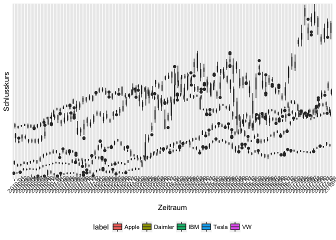

Stockmarket Google Finance
================

Get and plot historical stokmarket data from Google Finance
-----------------------------------------------------------

As the yahoo finance no longer seems to work, an alternative using google data.

``` r
# necessary libraries
library(readr)
library(ggplot2)
library(lubridate)
```

    ## 
    ## Attaching package: 'lubridate'

    ## The following object is masked from 'package:base':
    ## 
    ##     date

Function to get google finance data
-----------------------------------

Use the 'read\_csv' function from 'readr'

``` r
google_stocks <- function(sym, current = TRUE, sy = 2005, sm = 1, sd = 1, ey, em, ed)
{
  # sy, sm, sd: start year, start month and start day
  # ey, em, ed: end year, end month, and end day
  
  # If TRUE, use the date as the enddate
  if(current){
    system_time <- as.character(Sys.time())
    ey <- as.numeric(substr(system_time, start = 1, stop = 4))
    em <- as.numeric(substr(system_time, start = 6, stop = 7))
    ed <- as.numeric(substr(system_time, start = 9, stop = 10))
  }
  
  require(readr)
  query_result <- tryCatch(
    read_csv(paste0("http://finance.google.com/finance/historical",
                               "?q=", sym,
                               "&startdate=", paste(sm, sd, sy, sep = "+"),
                               "&enddate=", paste(em, ed, ey, sep = "+"),
                               "&output=csv")),
    error = function(e) NULL
  )
  
  
  return(query_result)
}
```

I want to read data from VW, Tesla, Daimler IBM and Apple
---------------------------------------------------------

``` r
apple_data = google_stocks('AAPL', sy = 2010)
vw_data = google_stocks('SWX%3AVW', sy = 2010)
tesla_data = google_stocks('tsla', sy = 2010)
dai_data = google_stocks('DAI', sy = 2010)
ibm_data = google_stocks('ibm', sy = 2010)
```

Label the data and combine them to one big data.frame
-----------------------------------------------------

``` r
apple_label <- rep("Apple", length(apple_data$Date))
apple_data$label <- apple_label

vw_label <- rep("VW", length(vw_data$Date))
vw_data$label <- vw_label

daimler_label <- rep("Daimler", length(dai_data$Date))
dai_data$label <- daimler_label

tesla_label <- rep("Tesla", length(tesla_data$Date))
tesla_data$label <- tesla_label

ibm_label <- rep("IBM", length(ibm_data$Date))
ibm_data$label <- ibm_label

shares_dac <- rbind(vw_data, dai_data, apple_data, ibm_data, tesla_data)
shares_dac$datum <- as.factor(shares_dac$Date)

shares_dax_order <- shares_dac[with(shares_dac, order(datum)),]
shares_dax_order$YM <- format(dmy(shares_dax_order$Date), "%Y-%m")
```

Save the data for further processing
------------------------------------

``` r
save(shares_dax_order, file="shares_dax_order.rda")
load("shares_dax_order.rda")
```

And do the Plots
----------------

 \#\# and save the plot as well

``` r
ggsave("shares_order.png", width = 30, height = 20, units = "cm")
```
